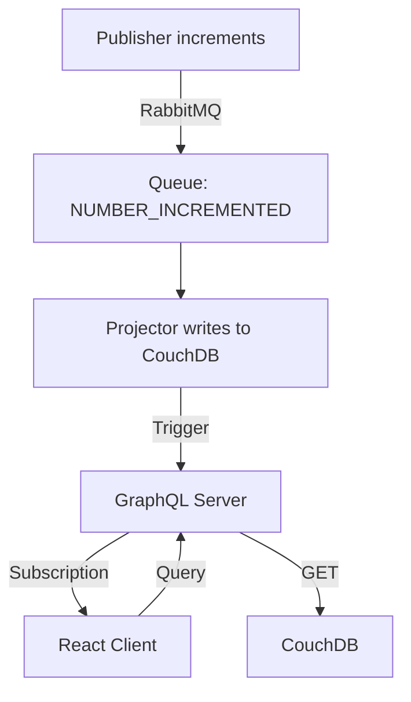

```mermaid
flowchart TD
  P[Publisher increments] -->|RabbitMQ| Q[Queue: NUMBER_INCREMENTED]
  Q --> Proj[Projector writes to CouchDB]
  Proj -->|Trigger| GQL[GraphQL Server]
  GQL -->|Subscription| Client[React Client]
  Client -->|Query| GQL
  GQL -->|GET| CouchDB
```